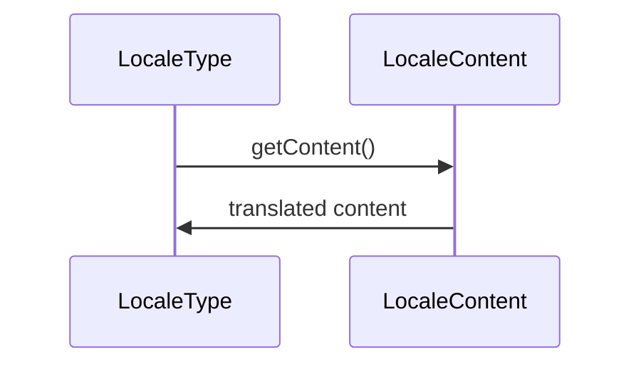
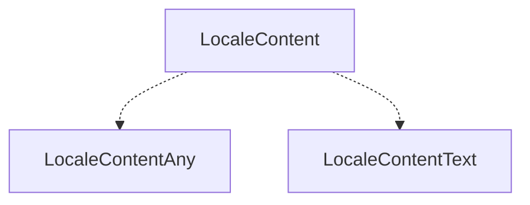

# Personal WebSite
Built using [Next.js](https://nextjs.org/) via [`create-next-app`](https://github.com/vercel/next.js/tree/canary/packages/create-next-app).

## First execution
```bash
git clone https://github.com/vqalves/site.git
cd site
npm install
npx next dev
```

## Simulate the cloud build process
This helps ensure locally that the cloud build process is less likely to encounter errors.
```bash
npm run build
```

## Locale strategy
Most text inside the site is wrapped around `LocaleContent`, which provides a translated text based on a locale.

Get content based on locale:


How the content is implemented:


## References for future updates:
https://accessibility.digital.gov/product/accessibility-basics/